# 프로젝트명 : 애니멀서마이벌(이지호)

# [ 목차 ]
### 1. [컨셉](#1)
### 2. [관련 이미지와 동영상](#2)
### 3. [대표 이미지 ](#3)
### 4  [컨셉 대표이미지 기반 작품 묘사](#컨셉과대표이미지)
### 4. [구성 요소](#4)
### 5. [게임 시스템 디자인](#5)
#### &emsp;&emsp; [1.오브젝트 분해](#오브젝트)
#### &emsp;&emsp; [1.행동](#행동)
#### &emsp;&emsp; [1.파라미터](#파라미터)
#### &emsp;&emsp; [1.상태](#상태)
#### &emsp;&emsp;  [1.플레이어 파라미터](#플레이어파라미터)
#### &emsp;&emsp; [1.규칙](#규칙)
#### &emsp;&emsp; [1.공식](#공식)

### 6. [개발 요구사항 & 흐름도](#66)
#### &emsp;&emsp; [1.전체](#전체)
#### &emsp;&emsp; [2.6주차](#6주차)

### 7. [개발 요구사항 & 흐름도](#7)
#### &emsp;&emsp; [요구사항](#요구사항)
#### &emsp;&emsp; [시간별 흐름도](#시간별흐름도)
#### &emsp;&emsp; [키보드 이벤트](#키보드이벤트)
#### &emsp;&emsp; [용어정리](#용어정리)
### 9. [스토리 보드](#9)
### 10. [개발 작업](#10)

### 작업. [1주차 작업 결과](files/w09/index.md)
### 작업. [2주차 작업 결과](files/w10/index.md)
### 작업. [3주차 작업 결과](files/w11/index.md)
### 작업. [4주차 작업 결과](files/w12/index.md)
### 작업. [5주차 작업 결과](files/w13/index.md)
### 작업. [6주차 작업 결과](files/w14/index.md)

# [컨셉 대표 이미지기반 작품묘사] 
## 메인 컨셉 : 컨트롤
- 전투를 통한 조작으로 게임에 몰입 할수있다.
- 조작이 복잡하면 플레이어는 어려운을 느낄수있다.

### 서브 컨셉 1 :회피

- 적들의 공격을 회피할수있는것으로 강력한 공격을 피했을때의 재미를 줄수있다

### 서브 컨셉 2 : 스킬

- 스킬을 구매함으로써 자신의 스타일에 알맞는 전투를 할 수있다
- 랜덤으로 나오는 스킬들로 랜덤의 재미를 느낄수있다

### 서브 컨셉 3 : 다수의 적

- 다수의 적을 한번에 처치 함으로 개운함을 느낄수있다

### 서브 컨셉 4 :호기심

- 랜덤한 스킬,옵션으로 랜덤한것의 궁굼증 어떤것이 나올지의 호기심을 가질수있다

  
# [대표 이미지]

# [관련 이미지 & 동영상] 

 
디펜스 게임으로 맵 한가운데에 있는 오브젝트를 지키는 게임 이다

 
멥 주변에서 적들이 몰려오고 플레이어는 2명의 캐릭터를 직접 조종하여 적들은 막아햐 한다

 
2명의 캐릭터를 조종해야하기에 각각의 유닛의 체력을 표시해주는 UI가 필요하다

 
스테이지가 끝나면 증강을 선택하여 강해질수있다 

농사를 하여 작물을 길러 먹이면 배고픔 수치가 채워진다 
 
스킬을 새로고침 하거나 캐릭터렙업을 하여 강해질수있다 

 
스테이지중엔 패턴이 있는 유닛,보스가 등장한다 

  

  

# [컨셉 & 대표이미지 기반 작품묘사]

> ### 대표이미지 기반 : 

> ### 컨셉 기반:
-적으로부터 수정을 지키는 동물들의 사투
  

# [<애니멀서바이발> 구성 요소] 

 

## 1. 메커니즘

[도전 과제]

1. 계속해서 나오는 적들을 막으며 강해져야한다
2. 최종보스몬스터를 잡을때까지 살아남아야한다
3. 다양한 스킬로 적에게 대항을 할수있다

   
[재미 요소]

1. 랜덤한 특수 능력,랜덤한 스킬들로 좋은 스킬을 얻었을때 즐거움
2. 제한된 회피스킬을 이용하여 도망, 적의 스킬을 회피한다

 

## 2. 이야기
숲속에 있는 수정을 지키기기 위해 적군의 보스와 싸워 봉인을 했지만 죽은 선대를 뒤을 이은 유닛들의 성장과
봉인이 점점 풀려 더 강한 유닛이 나오고 결국 봉인이 풀린 최종 보스를 물리쳐야한다

[만들게 된 배경]  
대부분의 게임들은 한개의 유닛만 플레이를 하기 때문에 두개의 유닛으로 컨트롤하는 게임이 있으면 어떨까 라는 생각으로 만들게 되었다

[참신함]
한개의 유닛이 아닌 두개의 유닛을 플레이하는것

[카메라 관점]  
기본적으로 마우스를 이용하여 화면 밖으로 마우스를 이동하면 해당 방향으로 카메라가 이동을 하고
화면 고정을 하면 카메라가 캐릭터을 따라 이동을한다

조작할 유닛을 선택하는 방법은 tap키를 누르거나 마우스 드래그를 이용해서 선택을 할 수 있다
 

## 3. 미적요소

[디자인][컬러]  
숲으로 둘러싸인 곳에서 숲한가운데 있는 수정을 지켜야한다

도트 디자인으로 동물의 형상을 가진 유닛이 나온다

미니맵을 만들어 유닛들의 위치,적들의 위치를 알수있게 보여준다

[음향]  
각 스킬마다 다른 타격감을 주고 보스가 나오면 배경음악또한 바꿔줘야한다
 

## 4. 기술

유니티2d를 이용하여 개발하고 pc기반으로 게임을 할 예정이다

# [게임 시스템 디자인] 

## 오브젝트 분해 

|연번|오브젝트 이름|오브젝트 이미지| 
|:----:|:----:|:----:|
|1|토끼|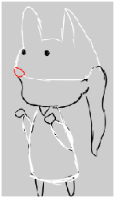| 
|2|오리|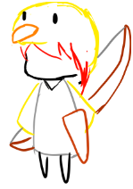| 
|3|박쥐|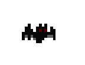| 
|5|붉은 악마|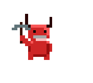| 
|6|붉은소|| 
|7|수정|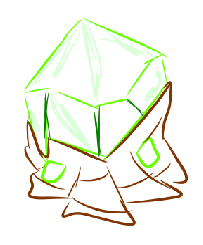| 
|8|npc|| 
|9|펭귄타워|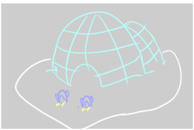| 
|10|갈매기 타워|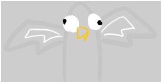| 
|11|해달타워|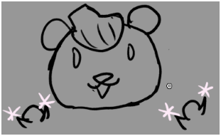| 
|12|쥐 타워|| 
|13|화염창|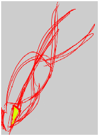| 
|14|화염 방어막|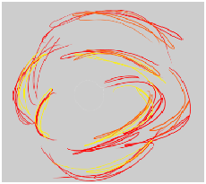| 
|15|불꽃찌르기|| 
|16|화살비|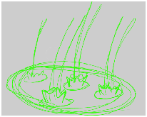| 
|17|마그넷화살|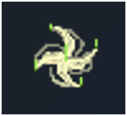| 
|18|더블샷|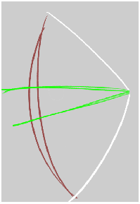| 
|19|인게임 체력 정보창|| 
|20|상점|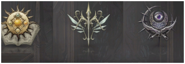| 
|21|인벤토리|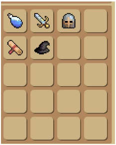| 
|22|내정보|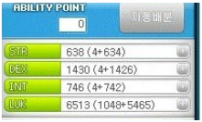| 
|23|증강|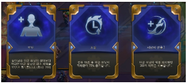| 
|24|인게임 플레이어 정보창|| 
|25|공격력 강화|| 
|26|체력 흡수|| 
|27|메테오|| 
|28|치명적인 속도|| 
|29|이중 구르기|| 
|30|공격력치중|| 
|31|공격속도 치중|| 
|32|암살자|| 

##  파라미터 

|속성|영문명칭|설명|
|:----:|:----:|:----:|
|수정|.|.|
|체력|Hp|게임에서 지켜야할 오브젝트의 체력이다|
|펭귄타워|.|.|
|적용할 값|Apply_Value|주변에 적이 있는 경우 느려지는 속도의 값|
|해달타워|.|.| 
|적용할 값|Apply_Value|주변의 유닛이 있는 경우 해당 유닛에게 올라가는 공격력의 값|
|갈매기 타워|.|.|
|공격쿨타임|Attack_Coltime|공격을 하기 위한 쿨타임|
|공격력|Attack_Power|공격력|
|공격 할 범위|Attack_Pos|공격이 떨어질 위치의 범위|
|공격오브젝트(갈매기)|Attack_Obj|특정 시간 마다 생성되는 공격의 오브젝트 프리팹|
|쥐 타워|.|.|
|음식 오브젝트|Food_Obj|쥐가 두고갈 음식의 오브젝트|
|생쥐 오브젝트|Rat_Obj|음식을 두고 가는 오브젝트|
|적용 범위|Food_Pos|음식이 놓여질 위치의 범위|
|음식 쿨타임|Food_ColTime|음식을 두고 가는 시간|
|생쥐의 이동속도|Rat_Speed|생쥐의 이동속도|
|볏집|.|.|
|체력|Hp|길막는(시간끌기) 용도의 오브젝트의 체력|
|박쥐,강아지,붉은 악마|.|.|
|체력|Hp|오브젝트의 체력|
|이동속도|Speed|오브젝트의 이동속도|
|공격력|Attack_Power|오브젝트의 공격력|
|공격 할 오브젝트|Attack_Target|오브젝트의 공격력|
|공격 범위|Attack_Range|공격 범위|
|붉은 소|.|.|
|체력|Hp|오브젝트의 체력|
|이동속도|Speed|오브젝트의 이동속도|
|공격할 오브젝트|Attack_Target|공격할 오브젝트|
|공격력|Attack_Power|오브젝트의 공격력|
|돌진 속도|Rush_Speed|돌진패턴의 속도|
|돌진 위치|Rush_Pos|돌진 할 위치|
|근접공격 범위 표시 오브젝트|RangeAttack_Obj|공격 범위를 표시해줄 오브젝트|
|실드 시간|Shield_Timer|실드를 킬 시간|
|랜덤 실드 시간|Random_shield_time|랜덤 실드 시간을 정해주는 랜덤 시간|
|화염창,불꽃찌르기,화살비|.|.|
|데미지|Damege|스킬의 데미지|
|스킬 오브젝트|Skill_Obj|생성될 스킬 오브젝트|
|화염 방어막|.|.|
|실드량|Shield_Amount|사용시 얻어지는 실드의 량|
|화염 방억막 오브젝트|Skill_Obj|생성될 스킬 오브젝트|
|마그넷 화살|.|.|
|당겨질 힘|Magnet_Power|사용시 적을 끌여당길 힘|
|당겨질 위치|Magnet_Pos|적이 끌여당겨질 위치|
|더블 샷|.|.|
|데미지|Damege|스킬의 데미지|

## 플레이어 파라미터 

|속성|영문명칭|설명|
|:----:|:----:|:----:|
|레벨|Lv|유닛 각각의 레벨|
|경험치|Exp|경험치|
|체력|Hp|생존을 할 수 있는 에너지|
|마나|Mp|스킬을 사용할 수 있는 에너지|
|실드량|Shield|실드스킬 사용시 나타나는 실드량|
|배고픔|Hunger|행동에 따른 에너지 소비량|
|데미지|Damege|기본 공격력|
|이동속도|Speed|기본 이동속도|
|공격속도|Attack_Speed|기본공격의 공격속도|
|이동할 위치|ArrivalPoint|마우스 우클릭시 이동할 위치|

##  행동 

[적(박쥐,강아지)]

|행동|영문명칭|설명|
|:----:|:----:|:----:|
|이동|Move|목표를 향해 가고 있는 상태|
|공격|Attack|목표물과 가까워 공격하고 있는 상태|
|사망|Die|Hp가 0이되어 사망한 상태|

[볏집,수정]

|행동|영문명칭|설명|
|:----:|:----:|:----:|
|생존|Live|Hp가 0보다 큰상태|
|파괴|Destroy|Hp가 0보다 작은 상태|

[유닛(토끼,오리)]

|행동|영문명칭|설명|
|:----:|:----:|:----:|
|이동|Move|이동을 하고 있는 상태|
|회피|Rolling|회피 스킬을 사용하고 있는 상태|
|각각의 스킬들|Skill|스킬을 사용하고 있는 상태|
|일반 공격|Nomarl_Attack|일반공격을 하고 있는 상태|
|가만히 있는 상태|Idle|가만히 있는 상대|

## 상태(버프,디버프) 

|현상태|전이상태|전이 조건|
|:----:|:----:|:----:|
|배고픔|공격력,공격속도가 느려짐|배고픔 수치가 30보다 낮은 경우|
|배부름|이동속도 느려짐|배고픔 수치가 70보다 높은 경우|
|적당함|디버프 없음|30<배고픔 수치<70|
|폭|공속 증가,공격력,이동속도|배고픔 상태에서 낮은 확률로 폭주상태가 된다|

## 게임의 규칙 
[핵심 규칙]
1.사용자는 2마리의 유닛을 조종하면서 각스테이지마다 몰려오는 적들을 막아야한다
2.스테이지가 끝나면 강해질수있는 증강,스킬을 선택,구매를 할 수 있다

점차 유닛은 강해질 것이고 적들은 점점 강한 공격을 하게될 것이다

플레이어들은 사망하면 기절 상태가 되고 상점에서 부활 씨앗을 구매하여 키워 살릴 수 있다
맵중앙에 있는 크리스탈이 파괴되면 게임은 패배를 하게 된다
스테이지를 진행하여 마지막 보스를 잡게 되면 게임은 승리하게 된다

[보조 규칙]
1.배고픔 수치를 조절하기 위한 농사 시스템으로 상점에서 씨앗을 구매하여 길러서 유닛의 먹이로 사용하거나  판매를 할 수 있다
2.돈관리를 하여 플레이어의 경험치를 늘려주어 렙업을 시켜 강화를 하거나 새로운 스킬을 구매하거나 더 많은 씨앗을 구매할 수 있다

## 게임에서 사용될 공식 
스킬 사용시
각 스킬의 사용마나<현제 마나
일 경우만 스킬을 사용할 수 있다

사용가능거리<=플레이어와 마우스사이의 거리 일 경우 스킬 사용이 가능하다

일반 공격인 경우
Attack_Delay>CulDelay
현제 딜레이가 공격딜레이보다 클 경우 일반 공격을 실행한다

애니메이션이 있는 모든 행동은 기본,걷기를 제외한 애니메이션의 실행이 끝나야 사용이 가능하다

경험치 업은 특정 골드가 소모되고 특정 경험치를 얻는다
만약에 Max_Exp<Exp 이라면 렙업을 한다 

보스의 경우
패턴 함수를 만들고 랜덤함수를 돌려서 만든다

일반 적인 경우
일단은 크리스탈을 향해 간다
가다가 유닛 또는 공격가능한 오브젝트가 있다면 해당 오브젝트를 공격한다

## 8. 개발 요구사항 & 흐름도 

-메인 

1.1 게임을 시작하면 시작 배경과 게임시작이 있다 
1.2 게임시작 버튼을 누르면 게임이 시작된다  

-인게임 
2.1 UI는 중앙아래 부분에는 선택된 캐릭터의 이미지,체력,마나를 볼수있는 UI가 있다 
2.2.스테이지시작버튼을 누르면 적들이 몰려온다  

*조작  
~~3.1 우클릭시 선택되어 있는 유닛을 이동 해당 위치로 이동을 시킨다 ~~
~~3.2 이동시에 도착 위치를 표시 해주는 마크를 해준다 ~~
~~3.3 이동시에는 이동하는 애니메이션을 실행한다 ~~
~~3.4 a키를 누르면 공격 가능 범위가 표시가 된다 ~~
~~3.5 범위가 표시 된 상태에서 a키 조작으로 적이 공격가능한 범위에 있으면 공격을 한다 ~~
~~3.7 적이 가까히 있을 경우 공격을 해준다 , 공격애니메이션이 실행이 된다 ~~
~~3.8 회피 스킬을 획득했을 경우 F키를 누르면 회피스킬을 사용할수있고 해당 스킬은 쿨타임을 가진다,회피 애니메이션이 실행이된다 ~~
3.9 q,w,e로 스킬을 사용할수있다 스킬 사용범위를 넘어가면 스킬은 사용이 취소가 된다 
3.10. 스킬을 누르면 스킬의 범위,스킬 적용 범위가 나온다 
3.11 스킬을 사용시에는 스킬 애니메이션이 출력이 되고 애니메이션 이벤트를 이용하여 알맞는 타이밍에 스킬을 출력되야한다  

*스테이지 후 조작 
4.1 모든 적을 다 잡으면 스테이지 클리어로 일정한 돈을 플레이어에게 지급한다 
4.2 스테이지 클리어시 증강을 선택할 수있고 증강은 3가지가 나온다 
4.3 스테이지 클리어시 Npc가 생성이 된다 
4.4 npc를 누르면 내정보,밭,상점이 표시가 된다 
4.5 내정보는 유닛을 선택할수있는 창이 나온다 
4.6 유닛을 선택하면 유닛의 정보가 나온다 
4.6.밭을 누르면 밭이 나오고 현제 심어저있는 작물들이 나온다 
4.7 상점을 누르면 스킬,작물을 구매할수있다 
4.8 스킬들은 스테이지 클리어시 랜덤으로 나온다  

*게임 종료 
5.1 조종가능한 유닛이 모두 죽으면 게임은 끝나게 된다 
5.2 게임 종료시에는 버텨낸 스테이지의 단계를 알려준다  

8.2. 시간별 흐름도 flowchart     
  

8.3. 키보드 이벤트에 대한 흐름도    
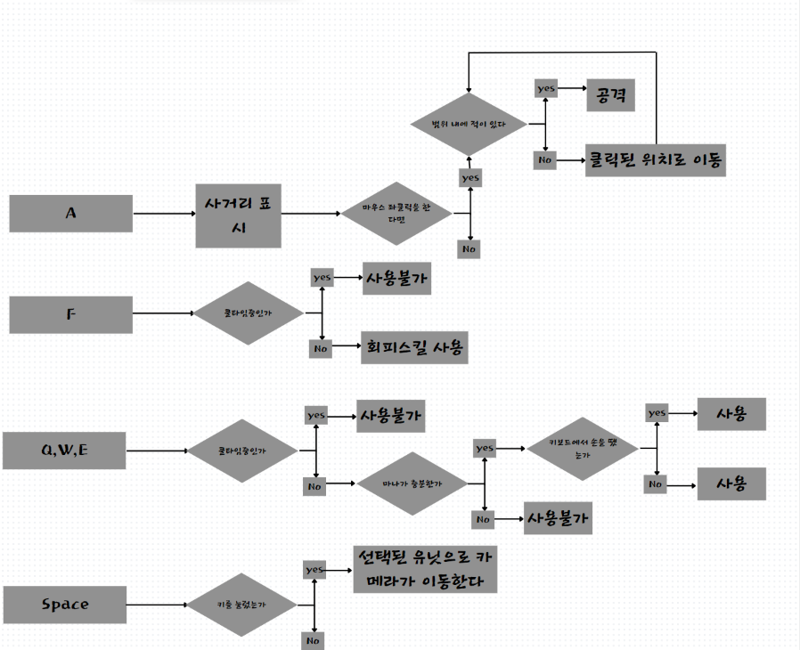  
    
8.4. 용어정리 

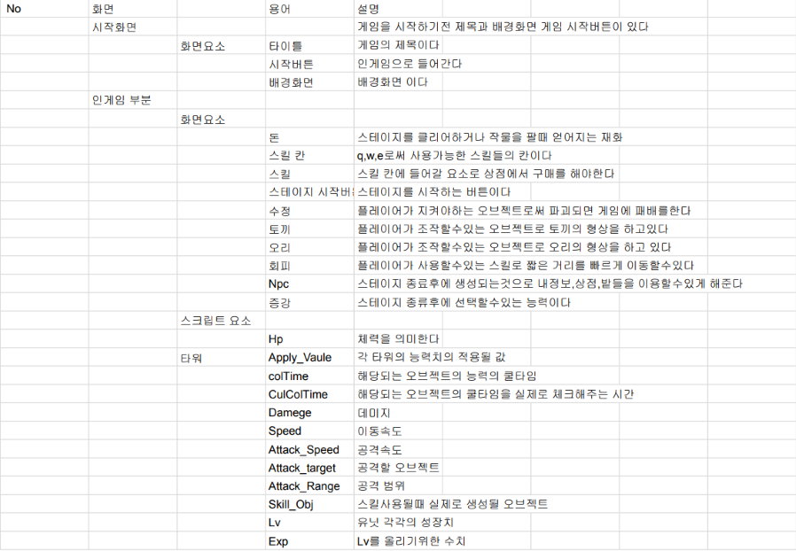  
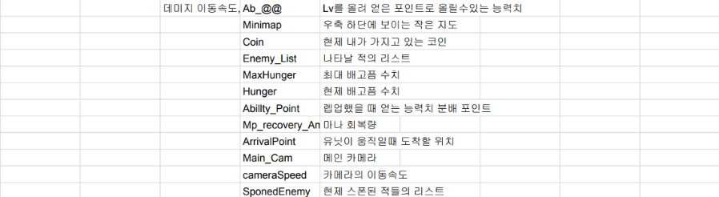  

8.[6주차 요구사항]   
~~1 우클릭시 선택되어 있는 유닛을 이동 해당 위치로 이동을 시킨다(3.1)~~

~~2 이동시에 도착 위치를 표시 해주는 마크를 해준다(3.2 )~~

~~3 이동시에는 이동하는 애니메이션을 실행한다(3.3 )~~

~~4.a키를 누르면 공격 가능 범위가 표시가 된다(3.4)~~

~~5 범위가 표시 된 상태에서 a키 조작으로 적이 공격가능한 범위에 있으면 공격을 한다(3.5)~~

~~6.  회피 스킬을 획득했을 경우 F키를 누르면 회피스킬을 사용할수있고 해당 스킬은 쿨타임을 가진다,회피 애니메이션이 실행이된다(3.8)~~

7. q,w,e로 스킬을 사용할수있다 스킬 사용범위를 넘어가면 스킬은 사용이 취소가 된다(3.9) 

8. 스킬을 누르면 스킬의 범위,스킬 적용 범위가 나온다(3.10)

9.스킬을 사용시에는 스킬 애니메이션이 출력이 되고 애니메이션 이벤트를 이용하여 알맞는 타이밍에 스킬을 출력되야한다(3.11)

10.  모든 적을 다 잡으면 스테이지 클리어로 일정한 돈을 플레이어에게 지급한다 (4.1)

11. 스테이지 클리어시 증강을 선택할 수있고 증강은 3가지가 나온다(4.2)

12. 스테이지 클리어시 Npc가 생성이 된다(4.3)

13. 조종가능한 유닛이 모두 죽으면 게임은 끝나게 된다(5.1)

14. 게임 종료시에는 버텨낸 스테이지의 단계를 알려준다(5.2)
  
    

## 9.스토리 보드 

|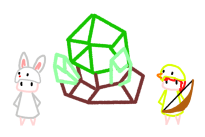|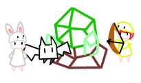|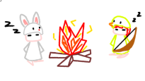|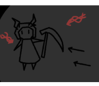|
|:----:|:----:|:----:|:----:|
|시네마 이벤트 왜인지 모르겠지만 어렸을때부터 지키고 있는 수정을 보여준다|인게임  수정을 공격해오는 적을 물리친다|시네마 이벤트  하루하루 적과 싸우다가 잠에 드는 모습을 보여준다|시네마 이벤트  꿈속에서 한 악마와 전투를 하는 꿈을 꾼다|
|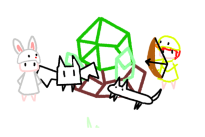|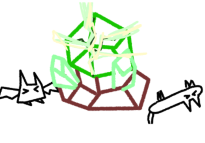|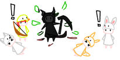|
|인게임  꿈에서 깨고 계속 몰려오는 적들을 잡는다|시네마 이벤트  적들이 빈사에 빠질때쯤 수정이 빛이 나면서 깨지기 시작한다|시네마 이벤트  수정안에는 꿈에서 봤던 악마가 있었고 쓰러져있던 적은 꿈속에서 봤던 동료들이였다|
