<!--
팀 귀농 
=============
개인 보고서
-------------

# 1988035 이지호
>### **1주차** 

오리엔테이션 및 팀원 정하기

>### **2주**

게임 기획 및 역환 분담하기

>### **3주**

|1. 플레이어 애니메이션을 위해 믹사모를 사용해서 캐릭터 리깅을 해서 모델을 제공하였다|
| :--: |
|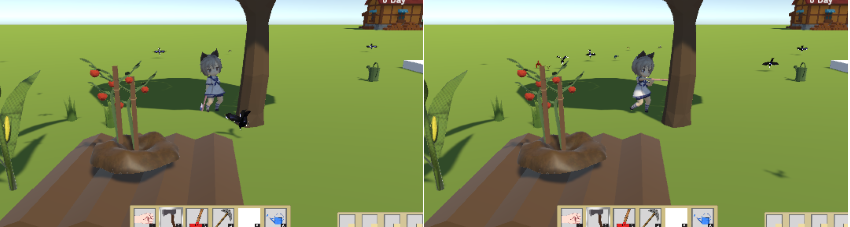|  
|2.3번을 누르면 도끼를 손에 장착하고 앞에 나무가 있고 좌클릭을 했을 때 나무를 베는 애니메이션과 함께 나무를 자를 수 있다|
|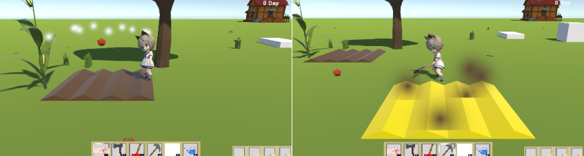|

>### **4주**
1~3키를 누르면 도구를 선택할 수 있다(1: 맨손(수확), 2:도끼(나무 베기)3:,삽(잡초제거))
해당 상호작용을 할 때 애니메이션을 출력하도록 하였다. 모든 상호작용이 끝나는 시간의 수치는 바로바로 변경할 수 있다

|잡초제거|
| :--: |
|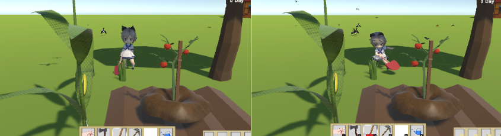 |

|수확|
| :--: |
|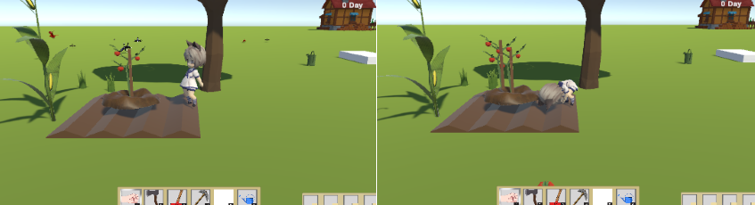 |

>### **5주**
수확 후 인벤토리에 연동, 밭 근처에 잡초 리스폰 기능 구현
수확 후 농작물에 가까이 가면 농작물을 획득하게 되고 인벤토리에 연동이 된다.
밭 근처 부분에 잡초가 일정 시간마다 생성이 된다.

|인벤토리 연동|
| :--: |
|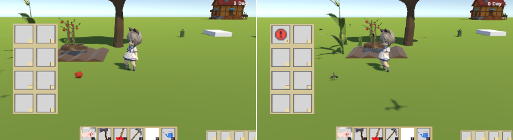 |

|잡초 생성|
| :--: |
|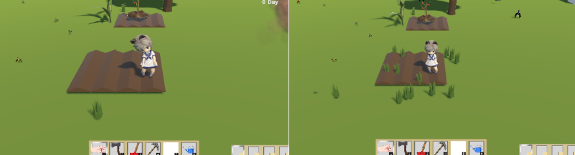 |

**6주**

밭 생성 시 발생하는 파티클,수확시 발생하는 파티클을 만들고 적용하였다

|파티클 생성|
| :--: |
| |

**7주**

# 1988035 이민학

>### 1주차

강의 소개 및 오리엔테이션

>### 2주차

팀 결성 및 계획서 작성

>### 3주차

| 1. 상점 열기, 아이템 구매 구현 |
|:--:| 
|  |

>### 4주차

| 1. 상점UI , 아이템 판매 구현 |
|:--:| 
|  |
|  |
|  |

>### 5주차

| 1. 아이템 구매시 인벤토리에 추가 구현 |
|:--:| 
|  |

>### 6주차

| 1. 상점 물품 2개 추가 |
| 2. 씨앗 구매시 씨앗 인벤토리로 이동 |
| 3. 인벤토리 수량 확인 후 판매 기능 구현 |
|:--:| 
|  |

>### 7주차

| 1. 상점 아이템, 상점 Npc 추가 |
|:--:| 
|  |

# 1988035 염경진

>### **1주차**

강의 소개 및 오리엔테이션

>### **2주차**

팀 결성 및 계획서 작성

>### **3주차**

| 1. 특정 키(“B”)를 누를 시 요리 레시피 UI 활성화 | 2. 레시피에서 아이템 이미지 위에 마우스를 이동 시 해당 아이템 설명 UI 활성화  |
| :--: | :--: |
|  |  |

>### **4주차**

| 1. 인벤토리 구현(아이템 획득 시 인벤토리에 추가) | 2. 특정 키(“E”)를 누를 시 인벤토리 UI 활성화  |
| :--: | :--: |
|  |  |

>### **5주차**

장염으로 인한 휴식

>### **6주차**

| 1. 중앙 하단 플레이어가 현재 들고 있는 도구를 확인 할 수 있는 UI추가 | 2. 우측 하단 씨앗 전용 인벤토리 구현 및 특정 키(“TAP”)로 씨앗 인벤토리 내 씨앗 선택 기능 추가  |
| :--: | :--: |
|  |   |

>>현재까지 만든 UI 전체 이미지

# 1988035 유정준

>### 1주차

강의 소개 및 오리엔테이션

>### 2주차

팀 결성 및 계획서 작성

>### 3주차

 1. 확률에 의해 비가 내리고 배경이 바뀌는 것 구현(배경 바뀌는 것은 없어짐)  

>### 4주차

| 1. 비의 강도가 점점 세지고 약해지는 것과 비 사운드, 안개를 추가해 디테일을 추가함  |
| :--: |
|  |

>### 5주차

| 1. 토네이도 구현(사운드 포함)및 랜덤 이동후 초기화  |
| :--: |
|  |

>### 6주차

| 1. 작물과 아이템 상호작용(토네이도와 접촉하면 확률에 의해 아이템은 사라지고 작물의 경우 꺾이거나 사라짐) | 2. 새 구현 (새가 날아다니고 랜덤으로 땅바닥으로 날아가서 앉음)  |
| :--: | :--: |
|  |  |

# 2088028 엄지승
>### 1주차, 2주차
교과목 오리엔테이션과 팀 결성, 각 담당 파트와 구현할 것들을 회의하여 나누었습니다.(캐릭터 이동, 카메라 회전, 밭 갈기, 씨앗 심기, 작물 자라기, 물 뿌리기, 수면 기능 담당)

>### 3주차
유니티상에서 플레이어가 이동(w -> 위쪽, a -> 왼쪽, s -> 아래쪽, d -> 오른쪽)하는 것을 구현, 카메라 회전(마우스 우클릭을 하면서 오른쪽, 왼쪽으로 당기면 그 방향으로 카메라가 회전)을 구현하였습니다.

|(이동)|
| :--: |
|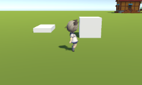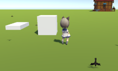|

|(카메라 회전)|
| :--: |
|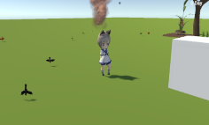|

 >###  4주차
 진행 방향에 따라 캐릭터 회전, 밭 갈기(Z키), 씨앗 심기(X키), 씨앗을 심었을 때 식물이 자라나는 것을 구현하였습니다.

|(밭 갈기)|
| :--: |
|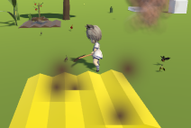|

|(씨앗 심기)|
| :--: |
||

|(식물 자라기)|
| :--: |
|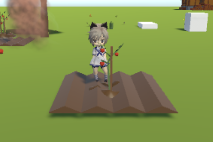|

 >###   5주차
 물뿌리기구현(C키)(특정 시간 동안 물을 주지 않으면 사라지고, 물을 주었을 때 밭 색상 변화), 곡괭이를 들었을 때 캐릭터는 회전하지 않음을 구현하였습니다. 
 
 |(물 주기 전)|
 | :--: |
| 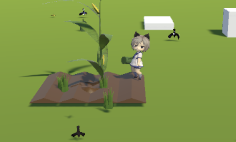|

 |(물 준 후)|
 | :--: |
|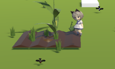|

 >### 6주차
카메라 회전(1주 차 땐 오른쪽, 왼쪽으로만 회전이 가능했지만 상, 하, 좌, 우 다 회전 가능하게 수정하였으며, 스크롤바에 따른 줌 인, 줌 아웃 구현), 특정 오브젝트 앞에서 F 키를 눌렀을 때 날짜가 바뀌는 것을 구현(아직 시간 시스템이 만들어지지 않았기 때문에 단순히 count를 더해주었음)하였습니다.

|(카메라 축소)|	  
 | :--: |
|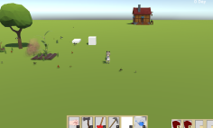|

|(카메라 확대)|
 | :--: |
|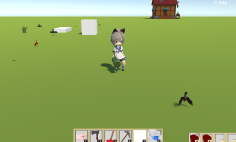|

| (수면 누르기 전)|
 | :--: |
 |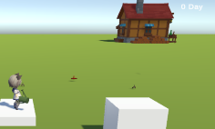|

|(누른 후) Day 값 증가|
 | :--: |
|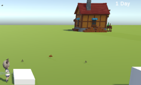|

|(카메라 회전)|
 | :--: |
|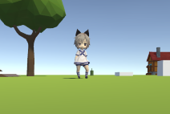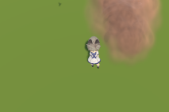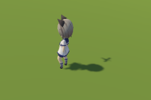|

-->

-------------

# 프로젝트명 : 애니멀서마이벌
# [컨셉]
## 메인 컨셉 : 컨트롤
- 전투를 통한 조작으로 게임에 몰입 할수있다.
- 조작이 복잡하면 플레이어는 어려운을 느낄수있다.

### 서브 컨셉 1 :회피

- 적들의 공격을 회피할수있는것으로 강력한 공격을 피했을때의 재미를 줄수있다

### 서브 컨셉 2 : 스킬

- 스킬을 구매함으로써 자신의 스타일에 알맞는 전투를 할 수있다
- 랜덤으로 나오는 스킬들로 랜덤의 재미를 느낄수있다

### 서브 컨셉 3 : 다수의 적

- 다수의 적을 한번에 처치 함으로 개운함을 느낄수있다

### 서브 컨셉 4 :호기심

- 랜덤한 스킬,옵션으로 랜덤한것의 궁굼증 어떤것이 나올지의 호기심을 가질수있다

  

# [관련 이미지 & 동영상]

- 
 
디펜스 게임으로 맵 한가운데에 있는 오브젝트를 지키는 게임 이다

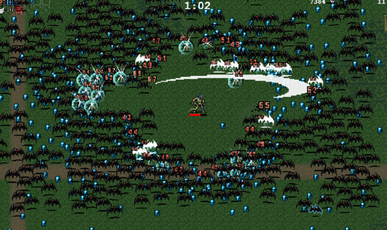 
멥 주변에서 적들이 몰려오고 플레이어는 2명의 캐릭터를 직접 조종하여 적들은 막아햐 한다

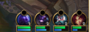 
2명의 캐릭터를 조종해야하기에 각각의 유닛의 체력을 표시해주는 UI가 필요하다

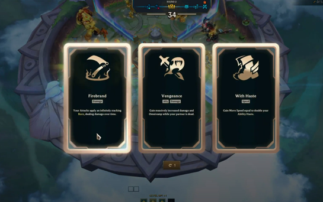 
스테이지가 끝나면 증강을 선택하여 강해질수있다

 
농사를 하여 작물을 길러 먹이면 배고픔 수치가 채워진다

스킬을 새로고침 하거나 캐릭터렙업을 하여 강해질수있다

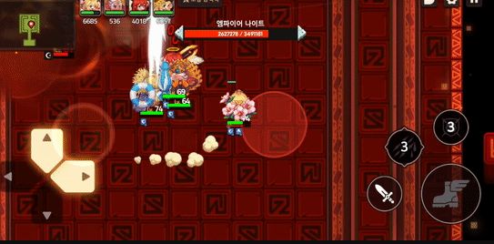 
스테이지중엔 패턴이 있는 유닛,보스가 등장한다

- 동영상
  

  

# [대표 이미지]

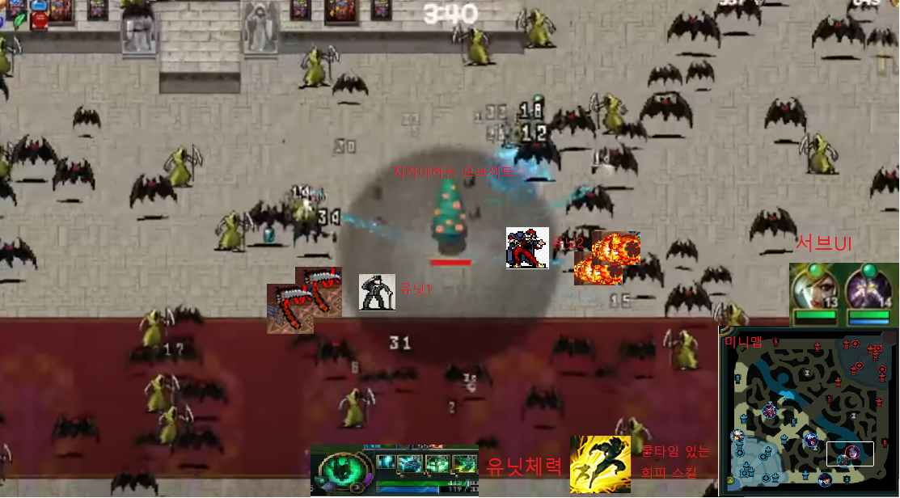

  

# [컨셉 & 대표이미지 기반 작품묘사]

> ### 대표이미지 기반 : 

> ### 컨셉 기반:
-적으로부터 수정을 지키는 동물들의 사투
  

# [<애니멀서바이발> 구성 요소]

 

## 1. 메커니즘

[도전 과제]

1. 계속해서 나오는 적들을 막으며 강해져야한다
2. 최종보스몬스터를 잡을때까지 살아남아야한다
3. 다양한 스킬로 적에게 대항을 할수있다

   
[재미 요소]

1. 랜덤한 특수 능력,랜덤한 스킬들로 좋은 스킬을 얻었을때 즐거움
2. 제한된 회피스킬을 이용하여 도망, 적의 스킬을 회피한다

 

## 2. 이야기
숲속에 있는 수정을 지키기기 위해 적군의 보스와 싸워 봉인을 했지만 죽은 선대를 뒤을 이은 유닛들의 성장과
봉인이 점점 풀려 더 강한 유닛이 나오고 결국 봉인이 풀린 최종 보스를 물리쳐야한다

[만들게 된 배경]  
대부분의 게임들은 한개의 유닛만 플레이를 하기 때문에 두개의 유닛으로 컨트롤하는 게임이 있으면 어떨까 라는 생각으로 만들게 되었다

[참신함]
한개의 유닛이 아닌 두개의 유닛을 플레이하는것

[카메라 관점]  
기본적으로 마우스를 이용하여 화면 밖으로 마우스를 이동하면 해당 방향으로 카메라가 이동을 하고
화면 고정을 하면 카메라가 캐릭터을 따라 이동을한다

조작할 유닛을 선택하는 방법은 tap키를 누르거나 마우스 드래그를 이용해서 선택을 할 수 있다
 

## 3. 미적요소

[디자인][컬러]  
숲으로 둘러싸인 곳에서 숲한가운데 있는 수정을 지켜야한다

도트 디자인으로 동물의 형상을 가진 유닛이 나온다

미니맵을 만들어 유닛들의 위치,적들의 위치를 알수있게 보여준다

[음향]  
각 스킬마다 다른 타격감을 주고 보스가 나오면 배경음악또한 바꿔줘야한다
 

## 4. 기술

유니티2d를 이용하여 개발하고 pc기반으로 게임을 할 예정이다

    

